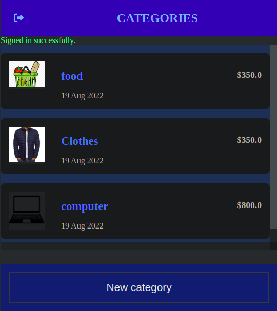
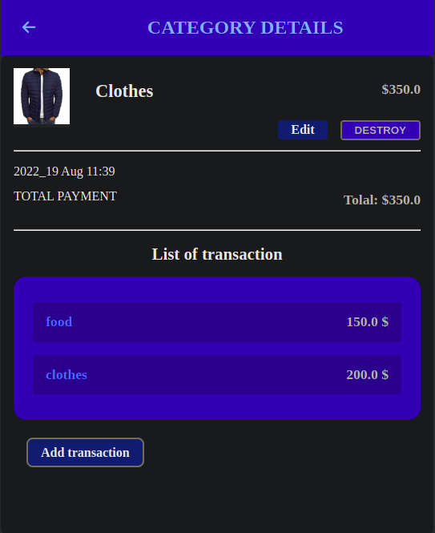

# Budget-App


## Description

> The Ruby on Rails capstone project ([remember what they are?](https://github.com/microverseinc/curriculum-html-css/blob/main/articles/capstone_intro.md)) is about building a mobile web application where you can manage your budget: you have a list of transactions associated with a category, so that you can see how much money you spent and on what.

- I created a Ruby on Rails application that allows the user to:

  - register and log in, so that the data is private to them.
  - introduce new transactions associated with a category.
  - see the money spent on each category.

### Screenshots 📸

    Categories
 


    Category-Details 
 


## Learning objectives

- Use ruby gems as software packages system.
- Install Ruby on Rails framework.
- Understand Rails RESTful design and router.
- Use controllers to handle requests and render empty views.
- Use params from browser request in a safe way.
- Use preprocessed html file with embedded Ruby code.
- Use layouts and templates for shared content.
- Use database migration files to maintain database schema.
- Use validations for models.
- Secure app from n+1 problems.
- Understand what ORM is.
- Write SQL queries with ActiveRecord.
- Set up associations between models.
- uild a webapp that requires the user to log in.
- Use devise gem for authentication.
- Limit access to webapp resources based on authorization rules.
- Analyze in writing why you have made a coding choice using one structure over another.

## Getting Started

To get a local copy for this project and running follow these simple example steps.

### Prerequisites

- You need to have git installed in your machine.
- Install Docker CLI or Docker Desktop


## Setup

### Clone this repository

```bash
$ git clone https://github.com/Surajkumar98012/Budget-App
$ cd Budget-App
```


- To start the server

```bash
$ docker-compose up --build                                                                   
```

### Listing Existing Routes

- You can now visit `http://localhost:3000` to view your new website!

### For deploying a PostgreSQL pod on Kubernetes using StatefulSet. 

```bash
$ kubectl apply -f postgres.yml                                                                  
```

## Built With 🛠️

This project is build with:

-  
-  

## Authors

👤 **Evans Sitibekiso**

- GitHub: [@evans22j](https://github.com/evans22j)

## 🤝 Contributor

👤 **Suraj Kumar**
- GitHub: [@Suraj kumar](https://github.com/Surajkumar98012)

Feel free to check the [issues page](https://github.com/evans22j/Budget-App/issues).

## Show your support

Give a ⭐️ if you like this project!

## Acknowledgments

- Credit to [Gregoire Vella on Behance](https://www.behance.net/gregoirevella), the author of the original [design guidelines](https://www.behance.net/gallery/19759151/Snapscan-iOs-design-and-branding?tracking_source=)


## 📝 License

This project is [MIT](./MIT.md) licensed.
